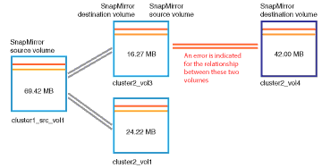

= Resolvendo problemas de atraso
:allow-uri-read: 
:icons: font
:imagesdir: ../media/

[role="lead"]
Este fluxo de trabalho fornece um exemplo de como você pode resolver um problema de atraso. Nesse cenário, você é um administrador ou operador acessando a página de visão geral/painéis do Unified ManagerDashboards para ver se há algum problema com seus relacionamentos de proteção e, se existirem, encontrar soluções.

== Antes de começar

Você deve ter a função Administrador do OnCommand ou Administrador do armazenamento.

== Sobre esta tarefa

Na página Dashboards/Visão geral, você analisa a área incidentes e riscos não resolvidos e vê um erro de atraso do SnapMirror no painel proteção em riscos de proteção.

== Passos

. No painel *proteção* na página *painéis/Visão geral*, localize o erro de atraso de relacionamento do SnapMirror e clique nele.
+
A página de detalhes do evento para o evento de erro de atraso é exibida.

. Na página de detalhes do *evento*, você pode executar uma ou mais das seguintes tarefas:
+
** Revise a mensagem de erro no campo causa da área Resumo para determinar se há alguma ação corretiva sugerida.
** Clique no nome do objeto, neste caso um volume, no campo origem da área Resumo para obter detalhes sobre o volume.
** Procure por notas que possam ter sido adicionadas sobre este evento.
** Adicione uma nota ao evento.
** Atribua o evento a um usuário específico.
** Confirmar ou resolver o evento.

. Nesse cenário, você clica no nome do objeto (neste caso, um volume) no campo fonte da área *Resumo* para obter detalhes sobre o volume.
+
É apresentado o separador proteção da página Health/volume details (Detalhes do estado/volume).

. Na guia *proteção*, você vê o diagrama de topologia.
+
Observe que o volume com o erro de atraso é o último volume em uma cascata SnapMirror de três volumes. O volume selecionado é delineado em cinza escuro e uma linha laranja dupla do volume de origem indica um erro de relacionamento SnapMirror.

+

. Clique em cada um dos volumes na cascata SnapMirror.
+
À medida que seleciona cada volume, as informações de proteção nas áreas Resumo, topologia, Histórico, Eventos, dispositivos relacionados e Alertas relacionados mudam para exibir detalhes relevantes para o volume selecionado.

. Você olha para a área *Summary* e posiciona o cursor sobre o ícone de informações no campo *Update Schedule* para cada volume.
+
Nesse cenário, você nota que a política SnapMirror é DPDefault, e a programação do SnapMirror é atualizada de hora em hora em cinco minutos após a hora. Você percebe que todos os volumes no relacionamento estão tentando concluir uma transferência SnapMirror ao mesmo tempo.

. Para resolver o problema de atraso, você modifica as programações de dois volumes em cascata para que cada destino inicie uma transferência de SnapMirror depois que sua origem concluir uma transferência.

