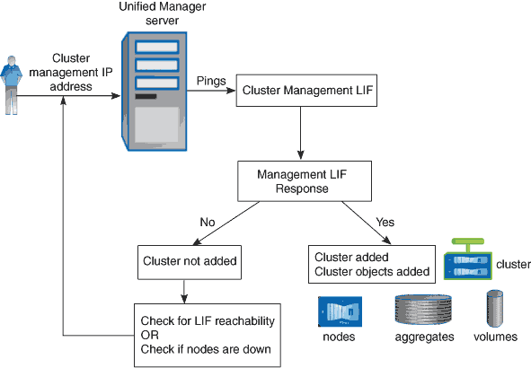

= Como funciona o processo de descoberta
:allow-uri-read: 
:icons: font
:imagesdir: ../media/

[role="lead"]
Depois de adicionar o cluster ao Unified Manager, o servidor descobre os objetos do cluster e os adiciona ao banco de dados. Entender como funciona o processo de descoberta ajuda você a gerenciar os clusters da sua organização e seus objetos.

O intervalo de monitoramento padrão é de 15 minutos: Se você tiver adicionado um cluster ao servidor do Unified Manager, levará 15 minutos para exibir os detalhes do cluster na IU do Unified Manager.

A imagem a seguir ilustra o processo de descoberta no Gerenciador Unificado do OnCommand:

