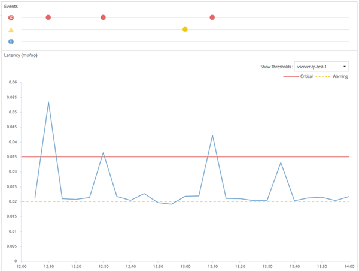

= Como funcionam as políticas de limite de performance definidas pelo usuário
:allow-uri-read: 
:icons: font
:imagesdir: ../media/

[role="lead"]
Você define políticas de limite de performance em objetos de storage (por exemplo, em agregados e volumes) para que um evento possa ser enviado ao administrador de storage para informar ao administrador de que o cluster está com um problema de performance.

Você cria uma política de limite de performance para um objeto de storage ao:

* Selecionar um objeto de armazenamento
* Selecionar um contador de desempenho associado a esse objeto
* Especificar valores que definem os limites superiores do contador de desempenho considerados situações críticas e de aviso
* Especificar um período de tempo que define quanto tempo o contador deve exceder o limite superior

Por exemplo, você pode definir uma política de limite de desempenho em um volume para receber uma notificação de evento crítico sempre que o IOPS desse volume exceder 750 operações por segundo por 10 minutos consecutivos. Essa mesma política de limite também pode especificar que um evento de aviso seja enviado quando o IOPS exceder 500 operações por segundo por 10 minutos.

[NOTE]
====
A versão atual fornece limites que enviam eventos quando um valor de contador excede a configuração de limite. Você não pode definir limites que enviam eventos quando um valor de contador cai abaixo de uma configuração de limite.

====
Um exemplo de gráfico de contador é mostrado aqui, indicando que um limite de aviso (ícone amarelo) foi violado às 1:00, e que um limite crítico (ícone vermelho) foi violado às 12:10, 12:30 e 1:10:

Uma violação de limite deve ocorrer continuamente durante a duração especificada. Se o limiar cair abaixo dos valores-limite por qualquer motivo, uma violação subsequente é considerada o início de uma nova duração.

Alguns objetos de cluster e contadores de performance permitem criar uma política de limite de combinação que exige que dois contadores de desempenho excedam seus limites máximos antes que um evento seja gerado. Por exemplo, você pode criar uma política de limite usando os seguintes critérios:

|===
| Objeto de cluster | Contador de desempenho | Limite de aviso | Limite crítico | Duração 

 a| 
Volume
 a| 
Latência
 a| 
10 milissegundos
 a| 
20 milissegundos
 a| 
15 minutos

|===
As políticas de limite que usam dois objetos de cluster fazem com que um evento seja gerado somente quando ambas as condições forem violadas. Por exemplo, usando a política de limite definida na tabela:

|===

| Se a latência do volume estiver na média... | E a utilização agregada do disco é... | Então... 

 a| 
15 milissegundos
 a| 
50%
 a| 
Nenhum evento é comunicado.

 a| 
15 milissegundos
 a| 
75%
 a| 
É comunicado um evento de aviso.

 a| 
25 milissegundos
 a| 
75%
 a| 
É comunicado um evento de aviso.

 a| 
25 milissegundos
 a| 
90%
 a| 
É comunicado um evento crítico.

|===