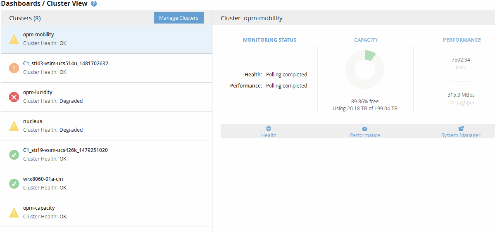

= Compreender o painel do Cluster View
:allow-uri-read: 
:icons: font
:imagesdir: ../media/

[role="lead"]
O painel de visão geral do Unified ManagerCluster View fornece informações de alto nível sobre a integridade dos clusters que você está gerenciando. O painel de visualização de cluster consiste em duas seções principais: Clusters gerenciados (à esquerda) e Detalhes de cluster (à direita).

A imagem a seguir mostra um exemplo de um painel do Unified ManagerCluster View que monitora oito clusters:

O ícone de status ao lado de cada nome de cluster pode estar nos seguintes estados:

* Crítico (image:../media/sev-critical-um60.png["Ícone para gravidade do evento – crítico"] ): Um ou mais eventos críticos ativos foram relatados para o cluster.
* Erro (image:../media/sev-error-um60.png["Ícone de gravidade do evento – erro"]): Um ou mais eventos de erro ativos foram relatados para o cluster.
* Aviso (image:../media/sev-warning-um60.png["Ícone de gravidade do evento – aviso"]): Um ou mais eventos de aviso ativos foram comunicados para o grupo de instrumentos.
* Normal (image:../media/sev-normal-um60.png["Ícone de gravidade do evento – normal"]): Não foram comunicados eventos ativos para o cluster.

[NOTE]
====
A cor indica se existem eventos ativos (novos ou reconhecidos) para o objeto. Eventos que não estão mais ativos, chamados eventos obsoletos, não afetam a cor do ícone.

====
Para exibir informações adicionais sobre um cluster, você pode executar uma das seguintes ações:

* Você pode clicar em um nome de cluster para exibir informações gerais sobre o status de monitoramento, o status da capacidade e o status de desempenho do cluster.
* Você pode clicar em *Manage clusters* para exibir a página Configuration/Cluster Data Sources, onde você pode exibir informações detalhadas de status de todos os clusters gerenciados por essa instância do Unified Manager.

