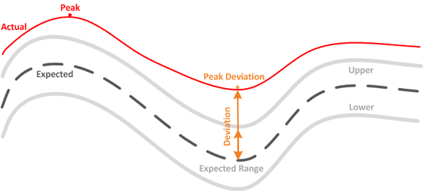

= Valores de medição de performance de workload
:allow-uri-read: 
:icons: font
:imagesdir: ../media/

[role="lead"]
O Unified Manager mede o desempenho de workloads em um cluster com base em valores estatísticos históricos e esperados, que formam o intervalo de valores esperado para as cargas de trabalho. Ele compara os valores estatísticos reais do workload com o intervalo esperado para determinar quando a performance do workload está muito alta ou muito baixa. Uma carga de trabalho que não está funcionando como esperado aciona um relatório de evento de desempenho para notificá-lo.

Na ilustração a seguir, o valor real, em vermelho, representa as estatísticas reais de desempenho no período de tempo. O valor real cruzou o limite de desempenho, que é os limites superiores do intervalo esperado. O pico é o valor real mais alto no período de tempo. O desvio mede a mudança entre os valores esperados e os valores reais, enquanto o desvio de pico indica a maior mudança entre os valores esperados e os valores reais.

A tabela a seguir lista os valores de medição de desempenho da carga de trabalho.

|===
| Medição | Descrição 

 a| 
Atividade
 a| 
Porcentagem do limite de QoS usado pelos workloads no grupo de políticas.

[NOTE]
====
Se o Unified Manager detetar uma alteração em um grupo de políticas, como adicionar ou remover um volume ou alterar o limite de QoS, os valores real e esperado poderão exceder 100% do limite definido. Se um valor exceder 100% do limite definido, é apresentado como >100%. Se um valor for inferior a 1% do limite definido, é apresentado como inferior a 1%.

====

 a| 
Real
 a| 
O valor de desempenho medido em um momento específico para uma determinada carga de trabalho.

 a| 
Desvio
 a| 
A mudança entre os valores esperados e os valores reais. É a relação do valor real menos o valor esperado para o valor superior do intervalo esperado menos o valor esperado.

[NOTE]
====
Um valor de desvio negativo indica que o desempenho da carga de trabalho é inferior ao esperado, enquanto um valor de desvio positivo indica que o desempenho da carga de trabalho é superior ao esperado. Se os valores esperados e o valor real forem muito baixos, nos centésimos ou milésimos de uma percentagem, por exemplo, o desvio irá apresentar N/A.

====

 a| 
Esperado
 a| 
Os valores esperados são baseados na análise de dados históricos de performance para uma determinada carga de trabalho. O Unified Manager analisa esses valores estatísticos para determinar o intervalo esperado de valores.

 a| 
Intervalo esperado
 a| 
O intervalo esperado de valores é uma previsão, ou previsão, do que os valores de desempenho superior e inferior devem ser em um momento específico. Para a latência do workload, os valores superiores formam o limite de performance. Quando o valor real cruza o limite de performance, o Unified Manager aciona um alerta de evento de performance.

 a| 
Pico
 a| 
O valor máximo medido durante um período de tempo.

 a| 
Desvio máximo
 a| 
O valor de desvio máximo medido durante um período de tempo.

 a| 
Profundidade da fila
 a| 
O número de solicitações de e/S pendentes que estão aguardando no componente de interconexão.

 a| 
Utilização
 a| 
Para os componentes de processamento de rede, Data Processing e agregado, a porcentagem de tempo de ocupado para concluir as operações de carga de trabalho por um período de tempo. Por exemplo, a porcentagem de tempo para o processamento de rede ou os componentes do Data Processing processarem uma solicitação de e/S ou para um agregado atender a uma solicitação de leitura ou gravação.

 a| 
Taxa de transferência de gravação
 a| 
A quantidade de taxa de transferência de gravação, em megabytes por segundo (Mbps), de cargas de trabalho em um cluster local para o cluster de parceiros em uma configuração do MetroCluster.

|===