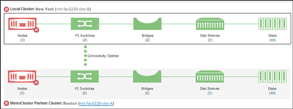

= Verificação da integridade dos clusters em uma configuração do MetroCluster
:allow-uri-read: 
:icons: font
:imagesdir: ../media/

[role="lead"]
Use o Unified Manager para verificar a integridade operacional dos clusters e seus componentes em uma configuração do MetroCluster. Se os clusters estiveram envolvidos em um evento de desempenho detetado pelo Unified Manager, o status de integridade pode ajudá-lo a determinar se um problema de hardware ou software contribuiu para o evento.

== Antes de começar

* Você deve ter a função Operador, Administrador OnCommand ou Administrador de armazenamento.
* Você deve ter analisado um evento de desempenho para uma configuração do MetroCluster e obtido o nome do cluster envolvido.
* Ambos os clusters na configuração do MetroCluster precisam ser monitorados pela mesma instância do Unified Manager.

== Passos

. No painel de navegação esquerdo, clique em *Eventos* para exibir a lista de eventos.
. No painel de filtro, selecione todos os filtros MetroCluster na categoria *tipo de fonte*.
. Ao lado de um evento do MetroCluster, clique no nome do cluster.
+
A página de inventário de integridade/clusters é exibida com informações detalhadas sobre o evento.

+
[NOTE]
====
Se não forem apresentados eventos MetroCluster, pode utilizar a barra de pesquisa para procurar o nome do cluster envolvido no evento de desempenho.

====
. Selecione a guia *conetividade MetroCluster* para exibir a integridade da conexão entre o cluster selecionado e seu cluster de parceiros.
+

+
Neste exemplo, são apresentados os nomes e os componentes do cluster local e do respetivo cluster de parceiros. Um ícone amarelo ou vermelho indica um evento de saúde para o componente realçado. O ícone conetividade representa o link entre os clusters. Você pode apontar o cursor do Mouse para um ícone para exibir informações de eventos ou clicar no ícone para exibir os eventos. Um problema de integridade em qualquer cluster pode ter contribuído para o evento de desempenho.

+
O Unified Manager monitora o componente NVRAM do link entre os clusters. Se o ícone de switches FC no cluster local ou de parceiros ou o ícone de conetividade estiver vermelho, um problema de integridade do link pode ter causado o evento de desempenho.

. Selecione a guia *replicação MetroCluster*.
+
image::../media/opm-um-mcc-replication-tab-png.gif[Guia replicação do Unified Manager MetroCluster]

+
Neste exemplo, se o ícone NVRAM no cluster local ou de parceiros estiver amarelo ou vermelho, um problema de integridade com o NVRAM pode ter causado o evento de desempenho. Se não houver ícones vermelhos ou amarelos na página, um problema de desempenho no cluster de parceiros pode ter causado o evento de desempenho.

