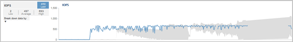

= Como as operações do cluster podem afetar a latência do workload
:allow-uri-read: 
:icons: font
:imagesdir: ../media/

[role="lead"]
As operações (IOPS) representam a atividade de todos os workloads definidos pelo usuário e definidos pelo sistema em um cluster. As estatísticas de IOPS ajudam a determinar se os processos de cluster, como fazer backups ou executar deduplicação, estão impactando a latência do workload (tempo de resposta) ou podem ter causado ou contribuído para um evento de performance.

Ao analisar eventos de desempenho, você pode usar as estatísticas de IOPS para determinar se um evento de desempenho foi causado por um problema no cluster. Você pode identificar as atividades específicas de carga de trabalho que podem ter sido os principais contribuintes para o evento de performance. As operações de entrada/saída por segundo (operações/seg) são medidas em operações por segundo (operações/seg).

Este exemplo mostra o gráfico de IOPS na página Detalhes de desempenho/volume. As estatísticas de operações reais são uma linha azul e o intervalo esperado de estatísticas de operações é cinza.

[NOTE]
====
Em alguns casos em que um cluster está sobrecarregado, o Unified Manager pode exibir a mensagem `Data collection is taking too long on Cluster cluster_name`. Isso significa que não foram coletadas estatísticas suficientes para que o Unified Manager analise. Você precisa reduzir os recursos que o cluster está usando para que as estatísticas possam ser coletadas.

====