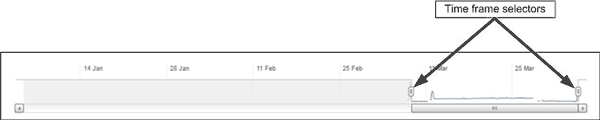

= Como funcionam os gráficos de dados de desempenho
:allow-uri-read: 
:icons: font
:imagesdir: ../media/

[role="lead"]
O Unified Manager usa gráficos ou gráficos para mostrar estatísticas de desempenho de volume e eventos durante um período de tempo especificado.

Os gráficos permitem-lhe personalizar o intervalo de tempo para o qual visualizar os dados. Os dados são exibidos com o período de tempo no eixo horizontal do gráfico e os contadores no eixo vertical, com intervalos de ponto ao longo das linhas do gráfico. O eixo vertical é dinâmico; os valores se ajustam com base nos picos dos valores esperados ou reais.

== Selecionar períodos de tempo

Na página Detalhes de desempenho/volume, o gráfico de dados históricos permite selecionar um período de tempo para todos os gráficos na página. Os botões 1D, 5D, 10d e 30d especificam de 1 dia a 30 dias (1 mês) e o botão *Custom* permite especificar um intervalo de tempo personalizado dentro desse período de 30 dias. Cada ponto em um gráfico representa um intervalo de coleta de 5 minutos e um máximo de 30 dias de dados históricos de desempenho é retido. Observe que os intervalos também são responsáveis por atrasos na rede e outras anomalias.

Neste exemplo, o gráfico de dados históricos tem um cronograma definido para o início e o fim do mês de março. No período de tempo selecionado, todos os dados históricos antes de Março ficam a cinzento.

== Visualizar informações do ponto de dados

Para exibir informações de ponto de dados em um gráfico, você pode posicionar o cursor sobre um ponto específico dentro do gráfico e uma caixa pop-up exibe a lista de informações de valor e data e hora.

image::../media/opm-chart-popup-png.gif[Mensagem de gráfico no Gerenciador de desempenho do OnCommand]

Neste exemplo, posicionar o cursor sobre o gráfico IOPS na página Detalhes de desempenho/volume exibe os valores de tempo de resposta e operações entre as 3:50 da manhã e as 3:55 da manhã do dia 20th de outubro.

== Visualizar informações de eventos de desempenho

Para exibir informações de eventos em um gráfico, você pode posicionar o cursor sobre um ícone de evento para exibir informações de resumo em uma caixa pop-up ou clicar no ícone de evento para obter informações mais detalhadas.

image::../media/opm-bully-volume-png.gif[Pop-up incidente no Performance Manager]

Neste exemplo, na página Detalhes de desempenho/volume, clicar em um ícone de evento no gráfico de latência exibe informações detalhadas sobre o evento em uma caixa pop-up. O evento também é destacado na Lista de Eventos.
