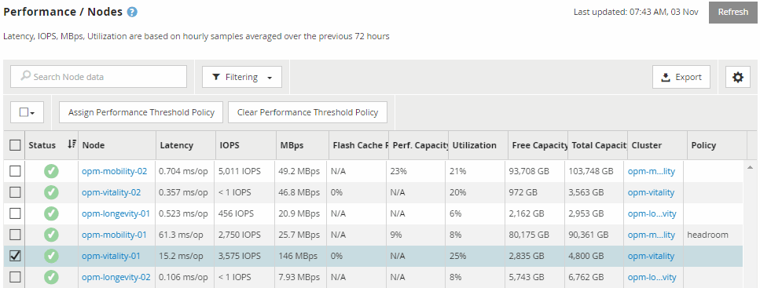

= Monitorando o desempenho usando as páginas Inventário de desempenho
:allow-uri-read: 
:icons: font
:imagesdir: ../media/

[role="lead"]
As páginas de desempenho de inventário de objetos exibem informações de desempenho, eventos de desempenho e integridade de objetos para todos os objetos dentro de uma categoria de tipo de objeto. Isso fornece uma visão geral do status de performance de cada objeto em um cluster, por exemplo, para todos os nós ou todos os volumes.

As páginas de desempenho de inventário de objetos fornecem uma visão geral de alto nível do status do objeto, permitindo que você avalie o desempenho geral de todos os objetos e compare os dados de desempenho do objeto. Você pode refinar o conteúdo das páginas de inventário de objetos pesquisando, classificando e filtrando. Isso é benéfico ao monitorar e gerenciar o desempenho do objeto, pois permite localizar rapidamente objetos com problemas de desempenho e iniciar o processo de solução de problemas.

Por padrão, os objetos nas páginas de inventário de desempenho são classificados com base na criticidade de desempenho do objeto. Os objetos com novos eventos críticos de desempenho são listados primeiro e os objetos com eventos de aviso são listados em segundo lugar. Isso fornece uma indicação visual imediata dos problemas que devem ser resolvidos. Todos os dados de performance são baseados em uma média de 72 horas.

Você pode navegar facilmente da página de desempenho do inventário de objetos para uma página de detalhes do objeto clicando no nome do objeto na coluna Nome do objeto. Por exemplo, na página de inventário de desempenho/nós, você clicaria em um objeto de nó na coluna *nós*. A página de detalhes do objeto fornece informações detalhadas e detalhes sobre o objeto selecionado, incluindo comparação lado a lado de eventos ativos.
