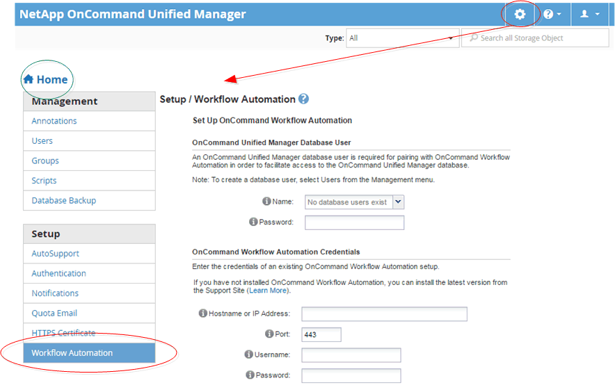

= Navegação da administração do Unified Manager
:allow-uri-read: 
:icons: font
:imagesdir: ../media/

[role="lead"]
A funcionalidade de administração do Unified Manager permite gerenciar usuários e fontes de dados. Você também pode realizar tarefas de configuração, como autenticação, AutoSupport, e-mail, certificados HTTPS, redes e servidores NTP usando a página Administração do Gerenciador Unificado.

Este é um exemplo de muitos caminhos de navegação de administração possíveis. Para adicionar ou remover uma conexão a um servidor do Workflow Automation, siga este exemplo de navegação:

[NOTE]
====
Clique no ícone *Home* para retornar à página principal de navegação do Unified Manager.

====